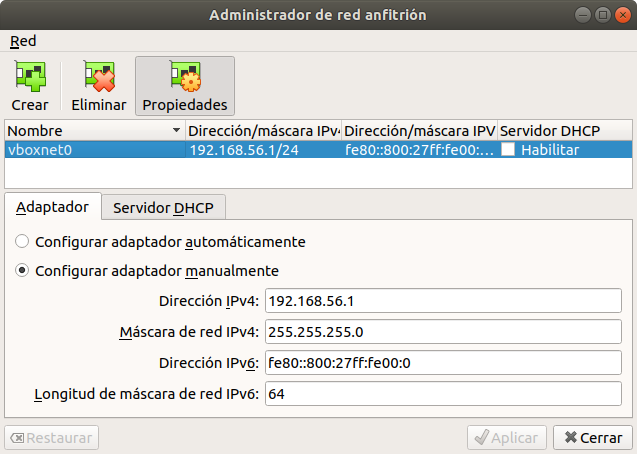
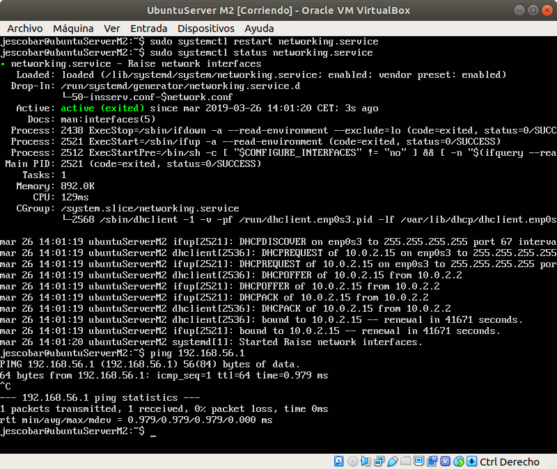
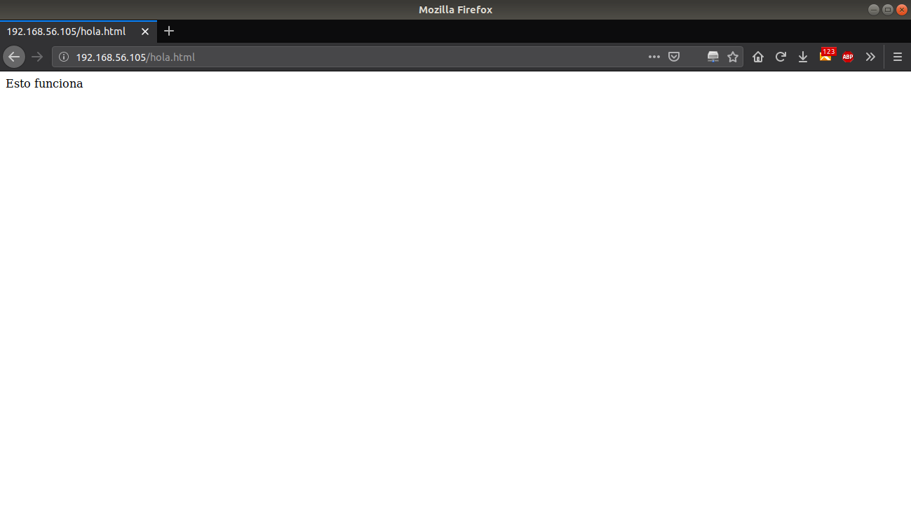
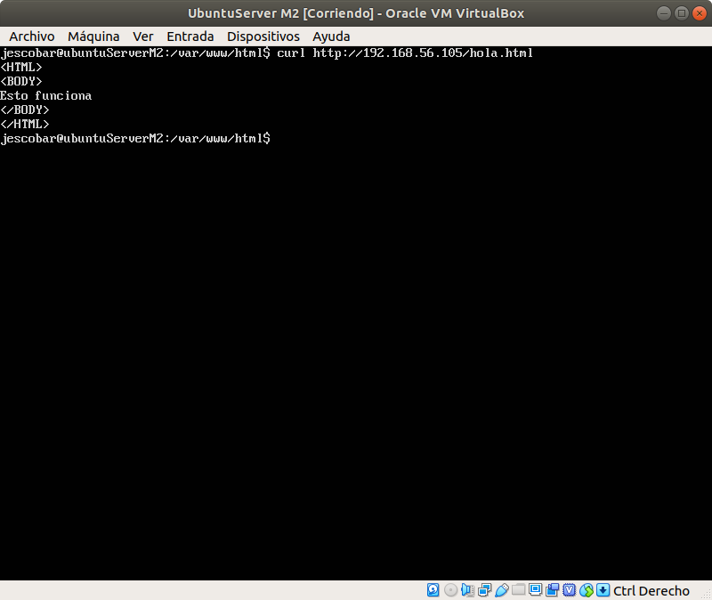
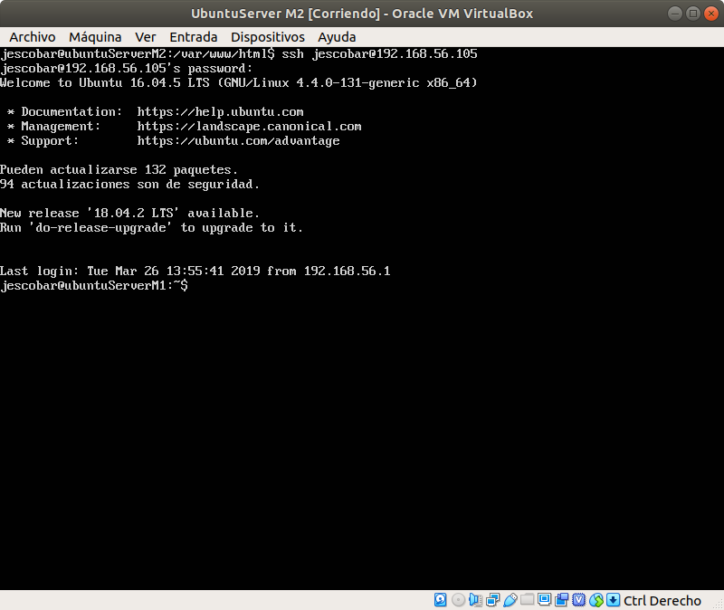

# Practica 1. Instalación y configuración de la máquinas
## Introducción
Esta práctica consiste en instalar máquinas desde cero con Ubuntu Server e instalarles los paquetes openSSH y LAMP, y a continuación, configurarlas para que puedan comunicarse unas con otras.

## Instalación y configuración
Tras completar la instalación por defecto, instalando openSSH y LAMP, lo siguiente es configurar las interfaces de red para conectar las diferentes máquinas. Pero antes debemos configurar el adaptador host-only de virtual box.



A continuación modificamos el archivo */etc/network/interfaces* de la siguiente manera:

```
# host-only interface
auto enp0s8
iface enp0s8 inet static
address 192.168.56.105
netmask 255.255.255.0 
```

En este momento estas son las IPs para las dos máquinas que tenemos:
 * M1: 192.168.56.105
 * M2: 192.168.56.110

Una vez configuradas las interfaces sólo debemos reiniciar el servicio y todo debería funcionar.



## CURL y SSH

Lo último que falta es probar que el servidor apache funciona perfectamente sirviendo las páginas web. Siguiente el ejemplo del guión de la práctica creamos archivo *hola.html*

```
<HTML> 
<BODY> 
Esto funciona 
</BODY> 
</HTML>
```

Lo podemos ver en el navegador del anfitrión



O usar la herramienta *curl* para solicitar la página de una máquina a otra.



Finalmente comprobamos que la conexión ssh funciona.

