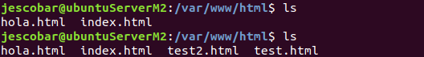

# Practica 2. Clonar la información de un sitio web

## Objetivos 
Los objetivos concretos de esta segunda práctica son: 
* aprender a copiar archivos mediante ssh 
*  clonar contenido entre máquinas 
*  configurar el ssh para acceder a máquinas remotas sin contraseña 
*  establecer tareas en cron

## Configurar el SSH sin contraseña
Nuestro objetivo es realizar copias de seguridad de forma automática desde la máquina 1 a la 2. Para ello la máquina 2 va a necesitar acceder a la primera máquina mediante ssh sin necesidad de que el usuario introduzca la contraseña una y otra vez.

Para ello generamos en la máquina una clave pública y privada usando el siguiente comando:

```
ssh-keygen -b 4096 -t rsa
```

Y a continuación mandamos la clave pública a la máquina 1 para que nos reconozca cuando abramos una conexión ssh:

```
ssh-copy-id 192.168.56.105
```

Completados estos pasos ahora la máquina 2 puede conectarse sin contraseña a la máquina 1.


## Realizar copias de archivos mediante rsync

Para realizar las copias primero hace falta adjudicar permisos de propiedad sobre los directorios en **ambas** maquinas:

```
sudo chown jescobar:jescobar –R /var/www
```

En este caso vamos a mantener copias de seguridad la carpeta */var/www* . Se podría configurar en más profundidad pero se va a mantener simple esta vez:

```
rsync -avz -e ssh 192.168.56.105:/var/www/ /var/www/
```

Si da problemas es porque probablemente se nos halla olvidado dar permisos de propiedad en alguna de las máquinas. Si no deberíamos encontrarnos en la máquina 2 con una copia de los archivos de la máquina 1.

## Automatizar tareas con Cron

Una vez que nos podemos conectar sin contraseña, y sabemos clonar carpetas y archivos de una maquina a otra, sólo nos falta automatizar el proceso.

Para ello entra en juego el servicio cron que se encarga de lanzar tareas de la forma que se lo especifiquemos en su archivo de configuración en */etc/crontab* .

Aquí podemos ver el archivo con la configuración para que nos realice copias de seguridad cada hora todos los días. La nomenclatura para cada columna es como sigue:

```
Minuto Hora DiaDelMes Mes DiaDeLaSemana Usuario Comando
```


En este caso tenemos la copia programada para el minuto 54 de cada hora.

Una vez modificado el archivo debemos reiniciar el servicio para que tengan efecto los cambios y ya sólo faltaría comprobar que efectivamente todo funciona automaticamente.

```
sudo systemctl restart cron.service
```

Adjunto un ejemplo en el que se realiza la copia de la maquina 1 a la 2 donde aparecen dos nuevos archivos de test para comprobar su correcto funcionamiento. 

