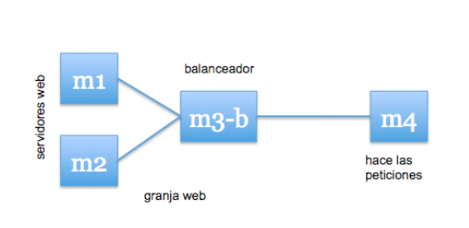
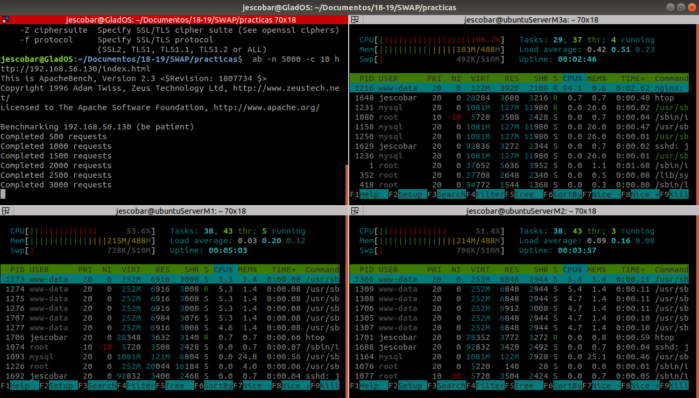
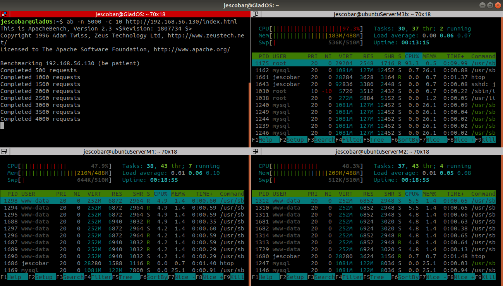
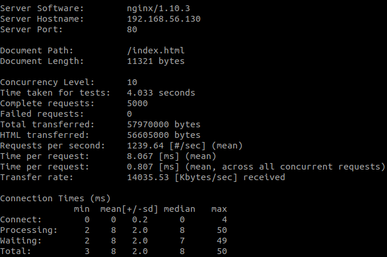
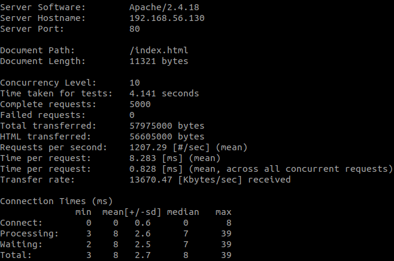

# Practica 3. Balanceo de carga

En esta práctica configuraremos una granja web con balanceo de carga para repartir el trabajo. Probaremos distintas alternativas, como nginx y haproxy, y sus configuraciones.



## Nginx

Lo primero será instalar nginx:

```
sudo apt-get update && sudo apt-get dist-upgrade && sudo apt-get autoremove
sudo apt-get install nginx
sudo systemctl start nginx
```

Y lo configuramos de la siguiente manera en */etc/nginx/conf.d/default.conf*

```
upstream apaches { 
    server 192.168.56.110; 
    server 192.168.56.120; 
}

server{ 
    listen 80; 
    server_name balanceador;

    access_log /var/log/nginx/balanceador.access.log; 
    error_log /var/log/nginx/balanceador.error.log; 
    root /var/www/;

    location / {
        proxy_pass http://apaches; 
        proxy_set_header Host $host; 
        proxy_set_header X-Real-IP $remote_addr; 
        proxy_set_header X-Forwarded-For $proxy_add_x_forwarded_for; 
        proxy_http_version 1.1; 
        proxy_set_header Connection ""; 
    }

}
```

En general le decimos a nginx que distribuya las peticiones que le vayan llegando entre el grupo de máquinas *apaches*.

Importante comentar la siguiente linea en */etc/nginx/nginx.conf* para que nginx no actue como servidor web:

```
include /etc/nginx/sites-enabled/*;
```

## Haproxy

Para instalar haproxy sólo necesitamos ejecutar:

```
sudo apt-get install haproxy
```

A continuación modificamos su archivo de configuración */etc/haproxy/haproxy.cfg*


```
global 
    daemon 
    maxconn 256

defaults 
    mode http 
    contimeout 4000 
    clitimeout 42000 
    srvtimeout 43000

frontend http-in 
    bind *:80 
    default_backend servers

backend servers
    server  m1 192.168.56.110:80 maxconn 32 
    server  m2 192.168.56.120:80 maxconn 32
```

Y finalmente ejecutamos haproxy con el siguiente comando:

```
sudo /usr/sbin/haproxy -f /etc/haproxy/haproxy.cfg
```

## Benchmarking

En esta práctica vamos a utilizar a aplicación apache benchmark (*ab*) para testear la sobrecarga de las máquinas. En este caso vamos a solicitar el *index.html* 5000 veces en tantas de 10 peticiones.

```
ab -n 5000 -c 10 http://192.168.56.130/index.html
```

Primero vamos a testear nginx: 



Y a continuación haproxy:



### Comparación de resultados

Como podemos observar en los resultados:

|Balanceador|Tiempo de servicio [ms] (media)|
|:-----|:--:|
|Nginx |8.067|
|Haproxy|8.283|

Ambos tiempos están bastante igualados así que parece que tienen un rendimiento bastante similar.

Aquí podemos observar todos los resultados de los test:



