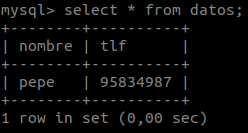
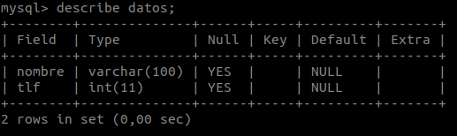
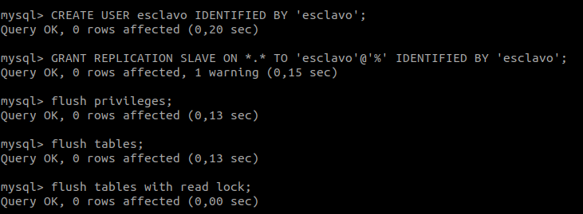
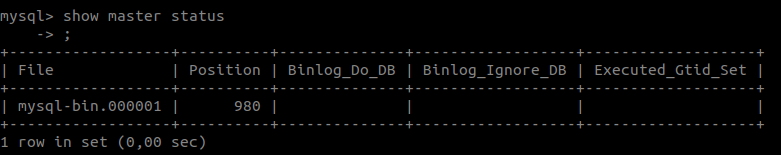

# Práctica 5. Replicación de bases de datos MySQL

Los objetivos de esta práctica son:
* Copiar archivos de copia de seguridad mediante ssh. 
* Clonar manualmente BD entre máquinas. 
* Configurar la estructura maestro-esclavo entre dos máquinas para realizar el clonado automático de la información.

En esta práctica se nos pide concretamente:

1. Crear una BD con al menos una tabla y algunos datos. 
2. Realizar la copia de seguridad de la BD completa usando *mysqldump* en la máquina principal y copiar el archivo de copia de seguridad a la máquina secundaria. 
3. Restaurar dicha copia de seguridad en la segunda máquina (clonado manual de la BD), de forma que en ambas máquinas esté esa BD de forma idéntica. 
4. Realizar la configuración maestro-esclavo de los servidores MySQL para que la replicación de datos se realice automáticamente.

## Crear una BD e insertar datos

Lo primero es acceder a la mysql:

    mysql -uroot -p

A continuación creamos la base de datos y cambiamos la BD en uso a ella:

    create database contactos;
    use contactos;

Lo siguiente es la creación de las tablas:

    create table datos(nombre varchar(100),tlf int);

Y finalmente insertar datos en ellas:

    insert into datos(nombre,tlf) values ("pepe",95834987);

Para consultar tablas, de forma muy simple, ejecutamos:

    select * from datos;

Para obtener una descripción de la tabla usamos:

    describe datos;

## Replicar una BD MySQL con mysqldump

Antes de hacer ninguna copia de la BD deberíamos bloquearla para que no se escriba en ella durante la copia. Lo haríamos de esta manera:

    mysql> FLUSH TABLES WITH READ LOCK;

Ahora sí podemos ejecutar *mysqldump* para hacer la copia:

    mysqldump ejemplodb -u root -p > /tmp/ejemplodb.sql

Y volveríamos a desbloquear la BD:

    mysql> UNLOCK TABLES;

La copia podríamos enviarla con el comando scp por ejemplo:

    scp /tmp/ejemplodb.sql 192.168.56.120:/tmp

Una vez la copia en la segunda máquina sólo necesitaríamos crear la BD con el mismo nombre, si no existiese, e insertarle la copia:

    mysql> CREATE DATABASE ‘ejemplodb’; 
    mysql> quit
    
    mysql -u root -p ejemplodb < /tmp/ejemplodb.sql

## Replicación de BD mediante una configuración maestro-esclavo

El primer paso es tener replicadas las bases de datos. Podemos usar *mysqldump* como hemos visto en el anterior apartado u otro método para ello.

A continuación modificamos el archivo de configuración */etc/mysql/mysql.conf.d/mysqld.cnf* con estos parámetros en la máquina 1:

    #bind-address 127.0.0.1
    log_error = /var/log/mysql/error.log
    server-id = 1
    log_bin = /var/log/mysql/bin.log

Guardamos y reiniciamos el servicio:

    /etc/init.d/mysql restart

En la máquina 2 actuamos de la misma manera pero cambiando *server-id = 2* .

Ahora introducimos las siguientes órdenes en la máquina que va a cumplir el rol de master:

Escribimos el siguiente comando y apuntamos el valor *position*:

    show master status;

Volvemos al esclavo y lo configuramos dentro de *MySQL*:

    mysql> CHANGE MASTER TO MASTER_HOST='192.168.56.110', MASTER_USER='esclavo', MASTER_PASSWORD='esclavo', MASTER_LOG_FILE='mysql-bin.000001', MASTER_LOG_POS=980, MASTER_PORT=3306;

Y lo inicializamos:

    mysql> START SLAVE;

Por último, volvemos al maestro y volvemos a activar las tablas para que puedan meterse nuevos datos en el maestro: 

    mysql> UNLOCK TABLES;

Para asegurarnos de que todo funciona perfectamente ejecutamos en el esclavo:

    mysql> SHOW SLAVE STATUS\G

Comprobamos que ambas bases de datos están sincronizadas introduciendo datos en el master y observando los cambios en las tablas del esclavo.