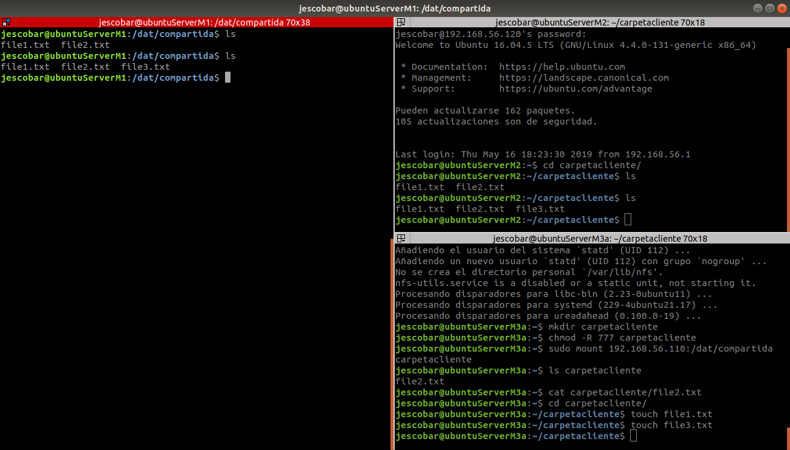

# Práctica 6. Servidor de disco NFS

En esta práctica vamos a configurar un servidor de disco NFS que compartirá espacio de disco a un par de clientes.

## Configurar el servidor NFS

Lo primero es instalar las herramientas necesarias para el servidor:

    sudo apt-get install nfs-kernel-server nfs-common rpcbind

Una vez instalados los programas pasamos a crear la carpeta a compartir y asignarle sus permisos:

    mkdir /dat/compartida 
    sudo chown nobody:nogroup /dat/compartida/ 
    sudo chmod -R 777 /dat/compartida/

Para dar permiso de acceso a las máquinas clientes, debemos añadir las IP correspondientes en el archivo de configuración */etc/exports*:

    /dat/compartida/ 10.10.10.9(rw) 10.10.10.10(rw)

Finalmente, reiniciamos sus servicio:

    sudo service nfs-kernel-server restart

## Configurar los clientes

Igual que antes, primero debemos instalar los paquetes necesarios y crear y configurar las carpetas:

    sudo apt-get install nfs-common rpcbind
    cd /home/jescobar
    mkdir carpetacliente 
    chmod -R 777 carpetacliente

A continuación, montamos las carpetas:

    sudo mount 192.168.56.110:/dat/compartida carpetacliente

Para que se monten las carpetas al inicio del sistema no olvidar modificar */etc/fstab* con:

    192.168.56.110:/dat/compartida /home/jescobar/carpetacliente/ nfs auto,noatime,nolock,bg,nfsvers=3,intr,tcp,actimeo=1800 0 0

Finalmente vamos a hacer una pequeña prueba para probar que funciona:

    ls –la carpetacliente 
    touch carpetacliente/archivo.txt

En la siguiente imagen se puede observar el servidor NFS (M1) y los clientes (M2) y cómo al crear diferentes archivos se reflejan en las otras máquinas:

